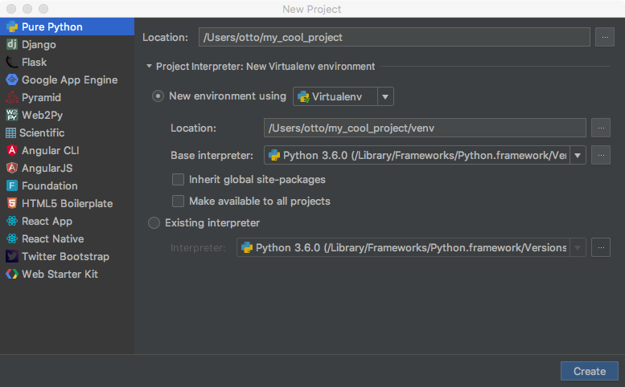
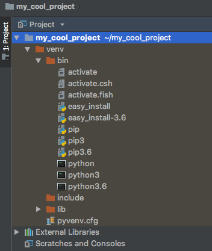
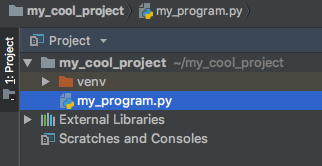

# Part 2

In this part, we will look at virtual environments and set up a project in PyCharm.

## 2.1 Virtual environments

A virtual environment is exactly what the name suggests, a virtual environment with a environment specific Python version and environment specific packages.

This helps us keep track of dependencies while giving us freedom to play around, without destroying or corrupting your whole system.
If you mess up with some packages or Python stops working, just create a new environment.

With the help of virtual environments, it is also easier to move your work from one system to an other and to release for production.

Some IDE's, such as PyCharm, create the virtual environment automatically, however, you can also create one manually.

Next, we will look at how to manually set up an environment.

### Setting up virtual environments

We will look at `virtualenv`, which is a lower level virtual environment tool. It is used via the terminal.

The first time, we have to install it. We will do it via `pip`:

```sh
$ pip install virtualenv
```

Test that the installation was successful:

```sh
$ virtualenv --version
```

To create a new virtual environment, in this case called `my_project`, navigate to your desired directory and create the virtual environment:

```sh
$ virtualenv my_project
```

This will automatically create a folder called `my_project` and add Python executables and pip.

To start the environment, we use the command `source`:

```sh
$ source my_project/bin/activate
```

When activated, a parenthesis containing the environment name should appear in your terminal:

```sh
(my_project)$
```

Now, everything you run and execute, does that within the virtual environment, and does not affect any packages outside of it.
Feel free to play around, install packages with pip or just run `python --version`

To deactivate your environment, run:

```sh
(my_project)$ deactivate
```

That's it!

### Note

It is recommended that you take brief look at more information about virtual environments before you continue. 
Do it [here](http://docs.python-guide.org/en/latest/dev/virtualenvs/#lower-level-virtualenv)!

## 2.2 Setting up the project

Now, as said, PyCharm creates the virtual environment automatically, so let's create the project!

Open PyCharm, and create a new project. I named mine `my_cool_project`, but you can call it what ever you like.



Make sure `New environment using` and `Virtualenv` are selected.

This will create your project and virtual environment.
When the indexing is finished, the project structure should look something like this:



As you can see, in the `venv/bin` directory, there is the same `activate` file we used when creating the virtual environment manually.
In the same directory you find all the Python binaries.

Do **not** put your `.py` files inside the `venv` directory, but rather in the root of your project directory.



Your project is now created!

## 2.3 Conclusion

The most important thing to learn from this part is how virtual environments are the best way to keep Python and everything related to it, well organized and safe.
It is recommended to always use virtual environments, so you do't accidentally ruin your system installed Python...
*Trust me, I know what I'm talking about!*
