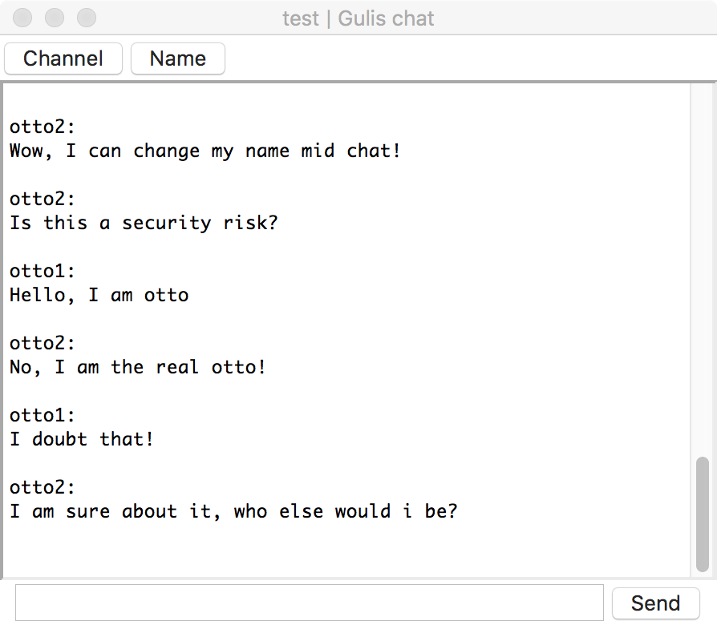
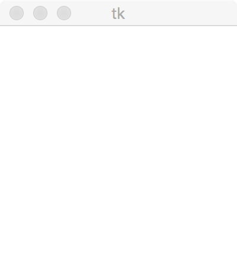
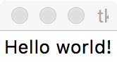
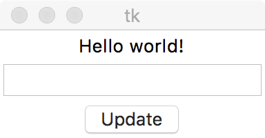

# Part 5

Now that our CLI chat client is ready, we wil move on to creating a simple GUI.

There are many options when it comes to creating a GUI in Python, but we will use Tkinter, which comes bundled with Python. Ig you wish to use something else, [here are some alternatives](https://docs.python.org/2/faq/gui.html).

In this part we create the GUI for our client and in part 6, we add functionality to it, so lets get cracking!

## 5.1 Understanding Tkinter

What we will be creating, is going to look something like this



Before we get to such a lovely UI (sorry), we must understand how the Tkinter framework works. To do this, we start by the simplest possible Tk program:

```python
from Tkinter import *

# Create a new Tkinter root element
root = Tk()

# Start our program
root.mainloop()
```

This will create an empty window, like so:



This looks quite boring, so let us add a `Frame` to our root element.

A `Frame` itself is also quite boring, but it allows us to add more elements to our UI and organize them neatly.

```python
from Tkinter import *

# Create a new Tkinter root element
root = Tk()

# We'll call our main Frame 'app', as this is what we will run
app = Frame(master=root)

# This is important as it is what actually writes the element on your screen
app.pack()

# Start our program, which is now 'app'
app.mainloop()
```

So far the output hasn't changed, it has only gotten smaller, so let's add a `Label`

```python
from Tkinter import *

# Create a new Tkinter root element
root = Tk()

# We'll call our main Frame 'app', as this is what we will run
app = Frame(master=root)

# Our label is added to the correct parent with the master parameter
label = Label(master=app, text="Hello world!")

# Remember to pack!
label.pack()

# This is important as it is what actually writes the element on your screen
app.pack()

# Start our program, which is now 'app'
app.mainloop()
```

Now, your application should look like this:



Ok, let's add an `Entry` and a `Button` below our `Label`.

```python
entry = Entry(master=app)
entry.pack()

button = Button(master=app, text="Update")
button.pack()
```

These must be before `app.pack()`!



Cool, but it would be even cooler if the button would do something...
Let's have it set the value of the `Label` to whatever we have typed in our `Entry`.

First, we modify our `Label` so we can change the value dynamically

```python
# We create a StringVar that we can modify later
label_value = StringVar()
label_value.set("Hello world!")

# Instead of text, we now use textvariable
label = Label(master=app, textvariable=label_value)
```

Then we create our function for setting the value of our `Label`

```python
# No parameters needed
def update_label():
    # The get-function is of type Entry, so better make it a string
    value = str(entry.get())
    # Set a new value for our Label
    label_value.set(value)
    # Clear the Entry fom index 0 to END. END is a Tkinter constant
    entry.delete(0, END)
```

Lastly, we must tell our `Button` to call our `update_label`-function when clicked

```python
# Add a parameter 'command' to our Button. Do not add parentheses to the function name
button = Button(master=app, text="Update", command=update_label)
```

Now, when the `Button` is clicked, the `Label` will get the value from our `Entry`.

There are many widgets in the Tkinter framework, so feel free to experiment. Google is your friend.

The full code for 5.1 can be found in [examples](examples/5.1/chat_gui.py)!

## 5.2 Extending the Frame

Now that we have a basic Tkinter GUI, we must continue our development of our awesome chat client.

Next, we add some functionality into our Frame, such as initialization of widgets and other configurations.

To keep things organized, we start by creating a class, which I will call `ChatGUI`. The class extends `Frame`, meaning it has the same functions as `Frame` and everything we add either is new or overrides functions from `Frame`.

```python
class ChatGUI(Frame):
    # Here we add our functions
```

One thing is mandatory, and that is the `__init__`-function. This is the constructor of the class, meaning it handles the arguments passed to the class and runs everything else you put here as soon as you create the object (class).

For example, running this:

```python
class MyObject():
    def printCreator(self):
        print(self.creator)

    def __init__(self, creator):
        self.creator = creator
        print("I was created by {}".format(self.creator))

obj = MyObject(creator="Otto")
obj.printCreator()
```

would produce this output:

```text
I was created by Otto
Otto
```

Now, this is not a tutorial on how classes work in Python, so I will not go deeper on this. I will however remind you that `self` refers to the class/object instance itself.

TODO: Find something cool about classes and link it here

Anyway, let's add some things to our class so we can test it.

```python
def __init__(self, master):
    Frame.__init__(self, master)    # Initialize the frame
    self.pack()                     # Pack everything
```

The `master` will essentially be equal to `Tk()`, so if you want, you can skip it all together and do this:

```python
def __init__(self):
    master = Tk()
    Frame.__init__(self, master)    # Initialize the frame
    self.pack()                     # Pack everything
```

Now our code looks like this:

```python
class ChatGUI(Frame):

    def __init__(self, master):
        # Initialize the frame
        Frame.__init__(self, master)
        # Pack everything
        self.pack()


# Init Tkinter
root = Tk()
# Create our frame
app = ChatGUI(master=root)
# Run the app
app.mainloop()
```

If we run this, we should get the familiar, empty frame. It might be hard to find, as there is nothing in it and no width is set, making it really small.

[Example code](examples/5.2/chat_gui.py)

## 5.3 Creating the layout

### 5.3.1 The base

Okay, now we want some sort of layout and that's exactly what we will do next.

We start by adding a function to our `ChatGUI`-class. I call this function `create_widgets`. We must also call this function from our class' `__init__`-function.

```python
class ChatGUI(Frame):

    def create_widgets(self):   # Note the self-argument
        pass    # pass means to just move on

    def __init__(self, master):
        Frame.__init__(self, master)
        # The call must be done before the final packing
        self.create_widgets()
        self.pack()
```

Note the use of `self` again.

To make our layout organized, we will use multiple `Frame`s inside our main Frame (ChatGUI).

Remember that you can make your UI exactly the way you want, this just happens to be how I think it should be layed out.

So, in our `create_widgets`-function, we start by adding some `Frame`s to better be able to organize stuff.

```python
def create_widgets(self):
    # Menu row
    self.MENU = Frame(self)
    # Here comes the stuff that goes in the menu

    # Pack and fill remaining space in X-axis
    self.MENU.pack(fill=X)

    # Some simple styling to our messages container frame
    self.MESSAGE_VIEW = Frame(self, borderwidth=2, relief=SUNKEN)
    # Messages and stuff

    self.MESSAGE_VIEW.pack()

    # The bottom row for text input
    self.WRITE_VIEW = Frame(self)
    # Text-inputs and stuff goes here

    self.WRITE_VIEW.pack()
```

This way our layout hopefully will have three sections.

### 5.3.2 The menubar

Now that we have these three sections made up by `Frame`s, we can start adding widgets into them, just like we would to any other frame. So let's start with the `MENU`, as it will contain only buttons.

```python
def create_widgets(self):
    # Menu row
    self.MENU = Frame(self)
    # Here comes the stuff that goes in the menu

    # Button for changing channel
    self.BTN_CHANNEL = Button(
        self.MENU,  # Parent element
        text="Channel",     # Text, duh
        command=self.set_channel    # On-click function
        )  

    # Remember to pack.
    # We also want it on the LEFT side in MENU
    self.BTN_CHANNEL.pack(side=LEFT, fill=X)

    # Button for changing name
    self.BTN_NAME = Button(
        self.MENU,  #Parent
        text="Name",    # Text
        command=self.set_name   # Onclick
        )

    # Pack
    self.BTN_NAME.pack(side=LEFT, fill=X)

    # Pack and fill remaining space in X-axis
    self.MENU.pack(fill=X)
```

Notice that we haven't created our functions yet! But how about this, let's create some empty functions for now and deal with this later.

```python
def set_name(self):
    return

def set_channel(self):
    return
```

### 5.3.3 The input view

Next I will make a very simple and frankly, quite boring input field and send button. Remember to experiment and make your software stand out!

```python
def create_widgets(self):
    # Menu row and message view
    ...

    # The bottom row for text input
    self.WRITE_VIEW = Frame(self)

    # Simple text-entry
    self.WRITE = Entry(
        self.WRITE_VIEW,    # Again, parent
        width=40    # Input width (columns)
        )

    # Pack it up!
    self.WRITE.pack(side=LEFT, fill=Y)

    # The send-button, packed
    self.BTN_SEND = Button(self.WRITE_VIEW, text="Send", command=self.send_message)

    self.BTN_SEND.pack(side=RIGHT, fill=X)

    self.WRITE_VIEW.pack()
```

Once again, we need to create a function for when the button is clicked. You can make it the same way as the other on-click-functions for now.

One thing to note, is that the `width` of the `Entry` is actually how many columns it is wide, not pixels or percentage.

Also, I have used different `fill` values when packing. Try to change these or remove them altogether.

### 5.3.4 The messages-view

Okay, last but definitely not least, we must create a view for all the messages. I left this as the last one, because there is some fiddling to do and we need a `Scrollbar` and such.

But let's start with the actual container for the messages. We have two options for in what we put our messages, `Listbox` and `Text`.

`Listbox` would maybe be simpler to use in this case. But I want it to look a bit better, so I went with `Text`. Because `Text` is a text-input box, some fiddling must be done, but more of that later. Time to add the stuffing!

```python
def create_widgets(self):
    ... # menu

    # Some simple styling to our messages container frame
    self.MESSAGE_VIEW = Frame(self, borderwidth=2, relief=SUNKEN)

    # The view for our messages
    self.MESSAGES = Text(
        self.MESSAGE_VIEW,  # Parent element
        height=20,  # Height (rows)
        width=60,   # Width (columns)
        foreground='black'  # Text color
        )

    # Pack, note the side
    self.MESSAGES.pack(side=LEFT, fill=Y)

    # Scrollbar, takes parent as argument
    self.SCROLLBAR = Scrollbar(self.MESSAGE_VIEW)

    # Pack and note the side again!
    self.SCROLLBAR.pack(side=RIGHT, fill=Y)

    self.MESSAGE_VIEW.pack()

    ... # message writing
```

Again, pay attention to the `height` and `width` of the `Text`, as they are in **rows** and **columns**.

Here you can also see how the `side` parameters can be used.

Now that we have our container for our messages and a scrollbar, we must bind them together.

Many elements have a function called `config`, in which you can pass additional parameters and rules. We will be using that command to tell both views what to do to the other, when interacted with. We must do this both ways as we will programmatically scroll `MESSAGES` to the bottom when a new message is received.

```python
def create_widgets(self):
    ... # menu

    self.MESSAGE_VIEW = Frame(self, borderwidth=2, relief=SUNKEN)

    self.MESSAGES = Text(self.MESSAGE_VIEW, height=20, width=60, foreground='black')

    self.MESSAGES.pack(side=LEFT, fill=Y)

    self.SCROLLBAR = Scrollbar(self.MESSAGE_VIEW)

    self.SCROLLBAR.pack(side=RIGHT, fill=Y)

    # Bind Scrollbar and Text
    # When SCROLLBAR is scrolled, set MESSAGES y-axis position
    self.SCROLLBAR.config(command=self.MESSAGES.yview)

    # When MESSAGES is scrolled, set SCROLLBAR position
    self.MESSAGES.config(yscrollcommand=self.SCROLLBAR.set)

    self.MESSAGE_VIEW.pack()

    ... # message writing
```

`self.MESSAGES.yview` is actually a function in `Text`, which takes the Y-coordinate `Scrollbar` passes it. Similarly `self.SCROLLBAR.set` is a function that sets the Y-axis value of a `Scrollbar`. With this configuration, whenever one of the widgets move, the other also does.

Okay, now there was that one thing I said about fiddling with the `Text`... We obviously don't want the user, even if it is just you, to be able to write anything inside `MESSAGES`. Take a moment and reflect on why you would or wouldn't allow the user to write anything inside the downloaded messages.

The issue with `Text`, is that if you disable the input capability with the argument `state=DISABLED`, the text turns gray and it looks ugly. More importantly though, you cannot add text, not even programmatically! You would have to set the `state` to `NORMAL`, add the text you want and then disable the `Text` again.

But, great news! There is a very easy way to allow programmatic input, while not allowing user input and keeping the normal font color. What we need to do is listen to any key, and just abort the normal action. This requires a `lambda`-function, but we won't go more into what that means in this tutorial.

```python
def create_widgets(self):
    ... # menu

    self.MESSAGE_VIEW = Frame(self, borderwidth=2, relief=SUNKEN)

    self.MESSAGES = Text(self.MESSAGE_VIEW, height=20, width=60, foreground='black')
    self.MESSAGES.pack(side=LEFT, fill=Y)

    self.SCROLLBAR = Scrollbar(self.MESSAGE_VIEW)
    self.SCROLLBAR.pack(side=RIGHT, fill=Y)

    self.SCROLLBAR.config(command=self.MESSAGES.yview)
    self.MESSAGES.config(yscrollcommand=self.SCROLLBAR.set)

    # Listen for keys and break
    self.MESSAGES.bind("<Key>", lambda e: "break")
    # End of magical line

    self.MESSAGE_VIEW.pack()

    ... # message writing
```

## 5.4 Conclusion

We have now created the layout for our awesome chat client. In the next part we will combine what we created for the CLI chat client with our new GUI.

If you haven't done the CLI client, please look at [part 3](../part3/README.md). It is also beneficial to know how the API works, so read [part 1](../part1/README.md), if you are unsure.

The full code for this part can be found in the examples directory.